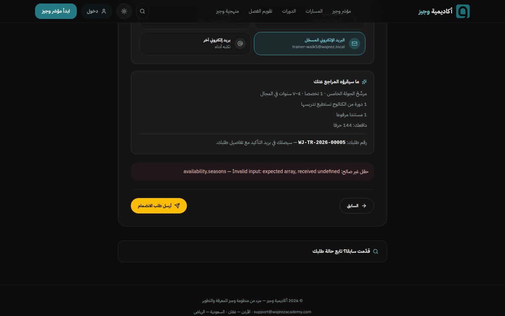
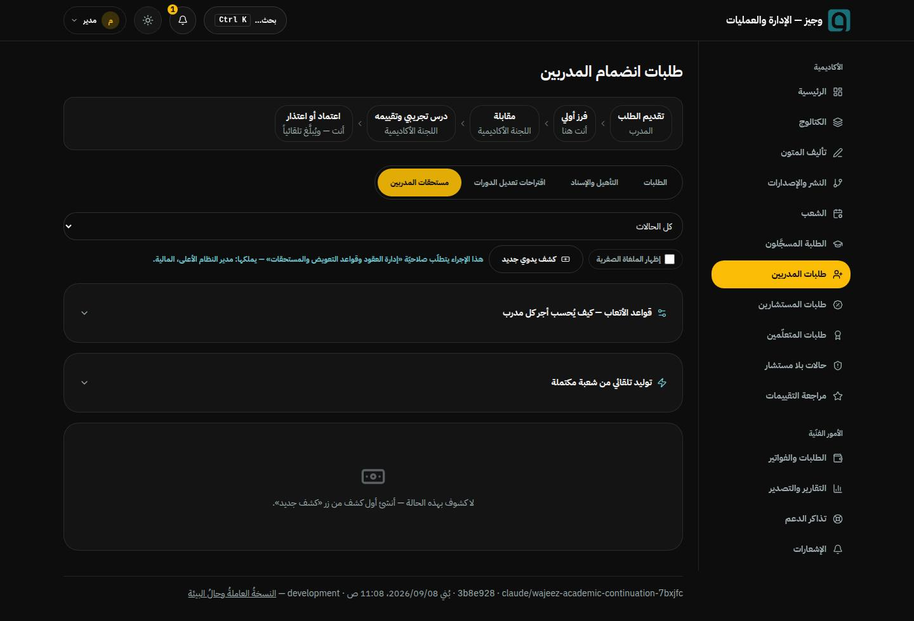
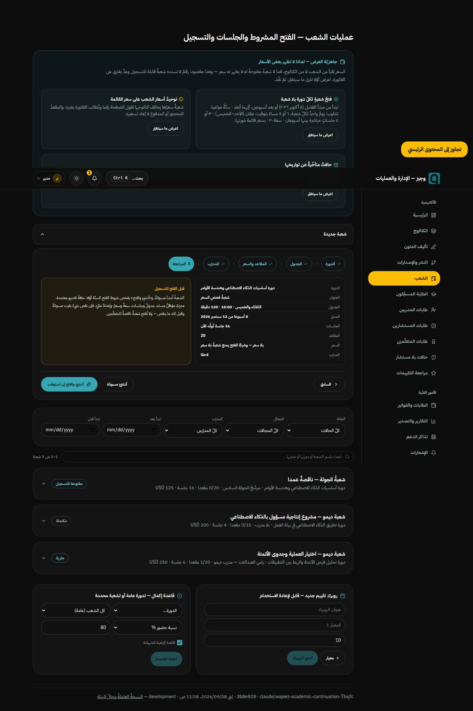
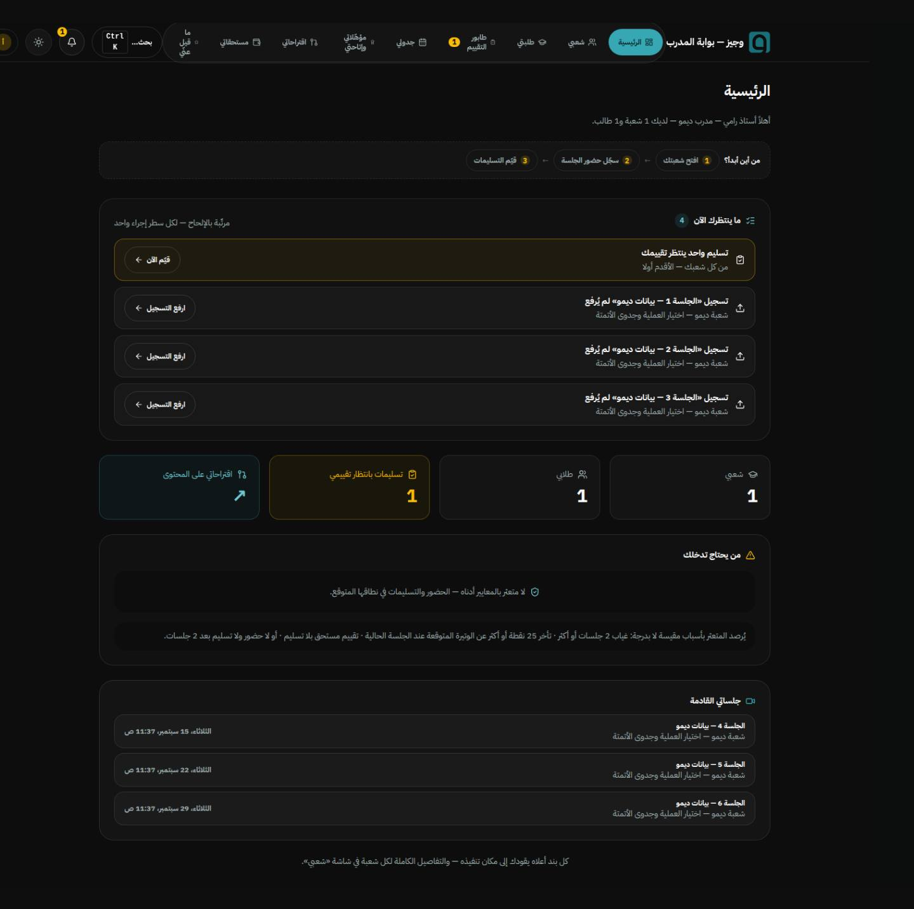
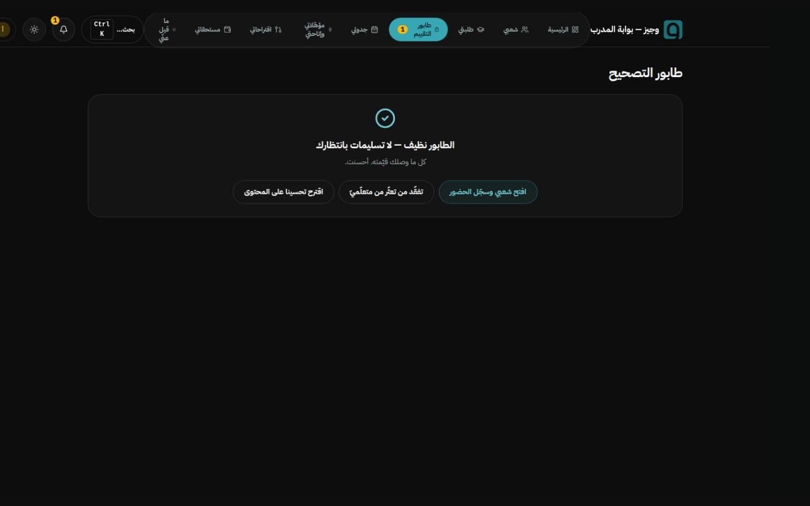
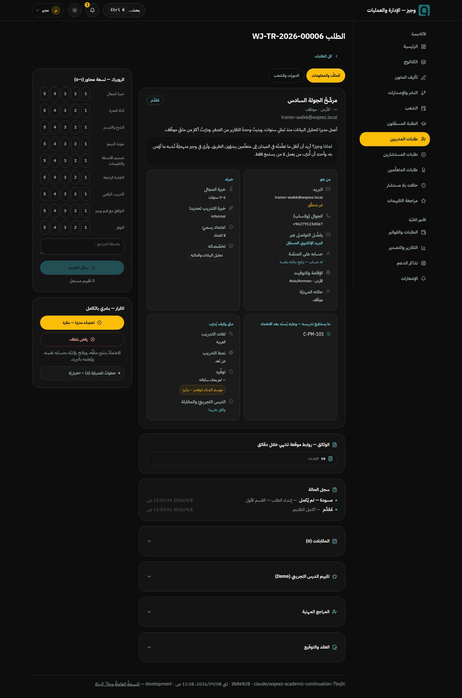
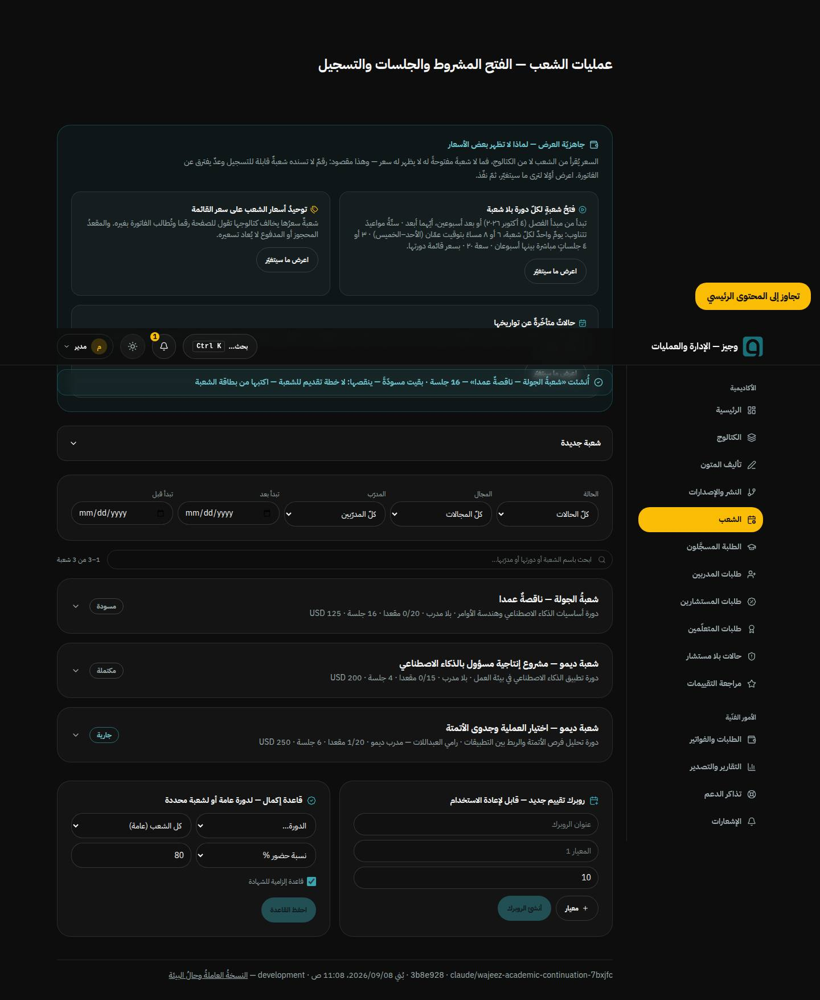
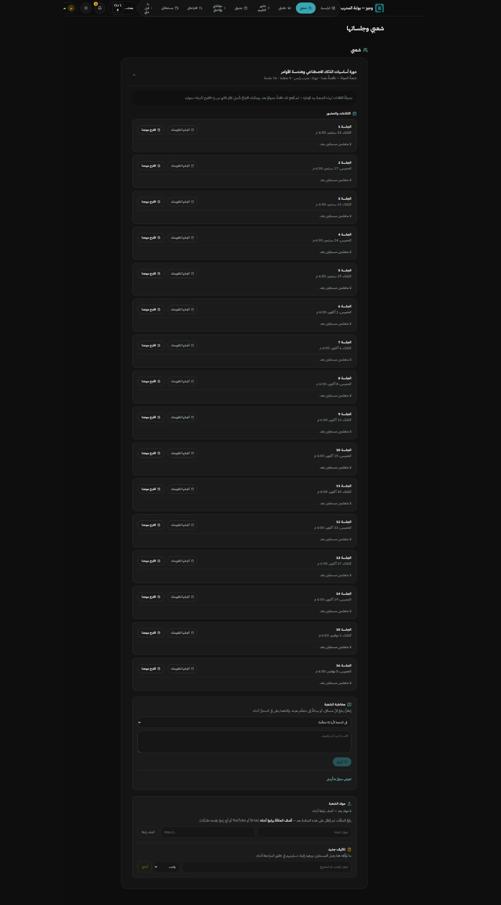
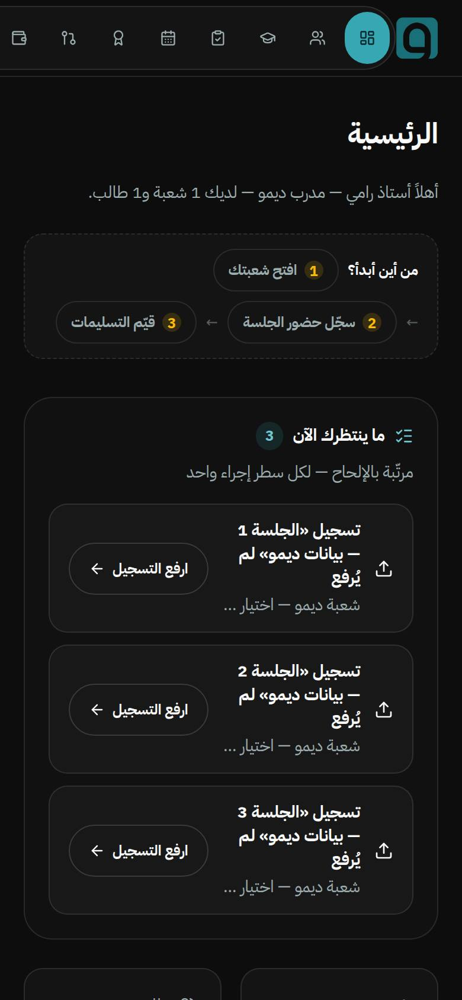

# 06 · جولةُ بوّابة المدرّب — البند ③ مَمشيّا خطوةً خطوة

> ٨ سبتمبر ٢٠٢٦ · على `main` عند `109aaf2` · بيئةٌ محلّيّةٌ كاملة (PostgreSQL ١٦
> حقيقيّة، الكتالوجُ كلُّه ٨١ دورة، حساباتُ الديمو العشرة) · **لا شيءَ من هذا لمس
> الإنتاج.**
>
> ولماذا وُجدت: البندُ ③ في [خطّة التنفيذ](../خطة-التنفيذ-القادمة.md) يقول إنّ
> «القراءةَ تكشف ما كُتب خطأً، ولا تكشف **ما ليس موجودا أصلا**». وهذه الجولةُ هي
> ذلك الكشف: ثمانيةُ خطواتٍ مُشِيت بالمتصفّح، ولم يُصلَح فيها شيء — كما نصّت
> الخطّة: «**ولا تُصلح شيئا في أثنائها**».

---

## ١ · كيف أُجريت — وما لا تستطيع أن تقوله

| البند | ما فُعل |
|---|---|
| القاعدة | عنقودُ PostgreSQL ١٦ حقيقيّ (لا مدمج — فالمدمجُ يأبى `initdb` تحت `root`)، ثمّ `prisma migrate deploy` و`import-catalog` (٢٠ مسارا · ٨١ دورة · ٤٠٤ وحدة · ٢٠٥ سؤالا) و`seed-demo` (عشرةُ حسابات) |
| المفتاحُ المهمّ | **`FILE_UPLOADS=off` عمدا** — كما هو في الإنتاج اليوم، كي تُقاس الخطوةُ ⑤ على حقيقتها لا على أمنية |
| الأداة | Playwright على Chromium، بمقاسَي ١٤٤٠×٩٠٠ و٣٩٠×٨٤٤، مع تسجيل أخطاء الكونسول وكلِّ نداءٍ غيرِ `GET` بجسم ردّه |
| الخطُّ | `IBM Plex Sans Arabic` يُخدَم محلّيّا باعتراضِ الطلب — وإلّا صُوِّر خطُّ النظام وحُكم على غيرِ ما يراه الزائر |

**وما لا تقيسه هذه الجولة، صراحةً:**

- **وصولَ البريد فعلا.** لا مفتاحَ `Resend` محلّيّا، والأثرُ يقولها بنفسه:
  `emailDelivery: "not_configured"`. فما قيل هنا عن البريد هو أنّ الحدثَ **رُصد**،
  لا أنّ الرسالةَ **وصلت**.
- **سلوكَ الدفع الحقيقيّ** — المزوّدُ تجريبيٌّ بأمر المالك.
- **بيانات الإنتاج.** ما وُجد هنا عطبُ شيفرةٍ يتكرّر في كلّ بيئة؛ وما اعتمد على
  بيانات الديمو قيل فيه ذلك.

---

## ٢ · الخطواتُ الثمانية — الحكم

| # | الخطوة | الحكم | الخلاصة |
|---|---|---|---|
| ① | اعتماد طلب انضمام | ⚠️ | الاعتمادُ **بنقرةٍ واحدة** كما وُعد — لكنّ **الطلبَ لا يُرسَل أصلا** إلّا مصادفةً (عطب ①) |
| ② | تأهيلُ المدرّب لدورة | ✅ | الشاشةُ المفقودةُ **موجودة**، والتأهيلُ يعمل، **والمدرّبُ يُخبَر** |
| ③ | إنشاءُ شعبةٍ وإسنادٌ وفتح | ✅ | الشروطُ الستّةُ تسمّي مانعَها، و«احفظ الخطّة» موجود، والشعبةُ فُتحت |
| ④ | جلسةٌ وحضورٌ ورابطُ لقاء | ✅ | الحضورُ يثبت، والرابطُ يصل حين يربطه المدير |
| ⑤ | «أضف مادّة» | ✅ | يقول الحقيقةَ بنصّها لا سقوطا مبهما |
| ⑥ | تكليفٌ وتسليمٌ وإشعار | ✅ | الإشعارُ وصل، **والرقمُ الذهبيُّ ظهر** |
| ⑦ | تصحيحٌ ورصدُ درجة | ⚠️ | الدرجةُ تُرصد و«وصلت درجتك» تصل — والشارةُ لا تنطفئ إلّا بإعادة تحميل |
| ⑧ | قراءةُ المستحقّات | ⚠️ | الصفرُ **صحيح**، والمعادلةُ شفّافة — لكنّ طريقَ ضبطِها **مسدودٌ على المالية** |

**فخمسٌ سليمة، وثلاثٌ فيها ما يُعالَج.** وأخطرُ ما وُجد ليس في الثمانية بل قبلها:
البابُ الذي يدخل منه المدرّبون.

---

## ٣ · العطب الأوّل 🔴 — بابُ المدرّبين مغلقٌ ولا يبدو مغلقا

**`/join-trainer` · الخطوة ٣ · زرّ «أرسل طلب الانضمام»**

المتقدّمُ يملأ النموذجَ الطويلَ كلَّه، ويرفع سيرتَه، ويوافق على الدرس التجريبيّ،
ويرى **زرَّ الإرسال مفعَّلا** — فينقره، فيُردّ بهذا:

> حقل غير صالح: `availability.seasons` — Invalid input: expected array, received undefined

**لماذا:** حقلُ «وفي أي مواسم السنة؟» **اختياريٌّ في الواجهة وإجباريٌّ في الخادم**.

| الطرف | الموضع | ما يفعل |
|---|---|---|
| الواجهة | `src/pages/JoinTrainer.tsx:399` | `seasons: seasons.length ? seasons : undefined` |
| الواجهة | `src/pages/JoinTrainer.tsx:345-370` | `missing[]` **لا تذكر المواسم** — فالزرُّ يُفعَّل بدونها |
| الواجهة | `src/pages/JoinTrainer.tsx:1028` | مجموعةُ المواسم بلا `required` وبلا نجمة |
| الخادم | `server/http/routes/trainer-applications.routes.ts:191` | `z.array(...).min(1)` — **بلا `.optional()`** |

**والبرهانُ بالنقض:** طلبٌ بلا موسمٍ ← بقي `draft` وردَّ `422`. وطلبٌ **الفرقُ فيه
نقرةٌ واحدةٌ على موسم** ← صار `submitted` فورا. أربعةُ طلباتٍ عالقةٌ في `draft` من
هذه الجولة وحدَها.

**والأثرُ أقسى من رسالةٍ قبيحة:** الحسابُ **يُنشأ** بدور `trainer_applicant` عند
المضيِّ من القسم الأوّل. فالمتقدّمُ يملك حسابا يدخل به، ولا يملك طلبا يُنظر فيه —
ولا شيءَ يقول له ذلك.

**ولمَ لم يمسكه اختبار:** اختباراتُ الخادم كلُّها تُثبّت `availability: { seasons: [...] }`
بيدها (`server/tests/trainer/applications.test.ts:93` وأخواتُها) — فهي **تغذّي
بنفسها الحقلَ الذي تُسقطه الواجهة**. كلُّ طرفٍ يعمل وحدَه بامتياز، والعطبُ في
الفراغ بينهما. وهو نصُّ ما فُتح له البند ③.

---

## ٤ · العطب الثاني 🔴 — المالية تملك المفتاح ولا تملك البابَ

**الصلاحيّتان، من جدول `RolePermission` نفسِه:**

| الصلاحيّة | من يملكها |
|---|---|
| `trainer.applications.view` | `super_admin` · `academic_manager` · `academic_coordinator` · `operations_manager` |
| `trainer.compensation.manage` | `super_admin` · **`finance`** |

**والتقاطعُ `super_admin` وحدَه.**

ومحرِّرُ «قواعد الأتعاب» (`TrainerPayouts` في `src/pages/admin/TrainerOps.tsx`)
لا يُستورَد إلّا في `src/pages/admin/TrainerApplications.tsx:17`، وهي لا تُركَّب
إلّا على `/admin/trainers` (`src/App.tsx:260`)، وبابُها يشترط
`trainer.applications.view` (`src/components/AdminLayout.tsx:69`).

**فقيس بالعين:**

- حسابُ **المالية** على `/admin/trainers`: «لا يمكن الوصول للبيانات — هذا الإجراء
  يتطلّب صلاحيّة «عرض طلبات انضمام المدربين»».
- حسابُ **المدير الأكاديميّ** يبلغ التبويبَ ويُردّ عند الفعل: «يتطلّب صلاحيّة
  «إدارة العقود وقواعد التعويض والمستحقات»».

**ولمَ هو خطيرٌ لا مزعجٌ فحسب:** بلا قاعدةِ أتعابٍ **لا يُولَّد كشفٌ إطلاقا** —
`computeCohort` يرمي `no_rule`. فهذا الطريقُ المسدودُ هو بعينه ما يُبقي شاشةَ
«مستحقّاتي» صفرا عند كلّ مدرّب.

---

## ٥ · بقيّةُ ما وُجد

### 🟠 معالجُ الشعبة يقول «بلا سعر» ثمّ يُنشئ شعبةً بـ١٢٥ دولارا

يرى المديرُ «سعرُ قائمة الدورة: **—** USD»، وفي المراجعة «السعر: **بلا سعر —
وشرطُ الفتح يمنع شعبةً بلا سعر**». ثمّ تُنشأ الشعبةُ بـ`125.00 USD` وتُفتح بلا مانع،
لأنّ `server/services/cohort.service.ts:76` يرث `course.listPrice` من القاعدة.

**السلسلةُ كاملةً:** `AdminCohorts.tsx:283` يقرأ السعرَ بـ`courseById()` — أي من
**الكتالوج المضمَّن** — بينما قائمةُ الدورات نفسُها تأتي من `/api/admin/catalog/courses`.
والمضمَّنُ لا يُملأ إلّا بـ`installCoreCatalogRaw`، ولا يستدعيه إلّا
`src/services/public-content.ts`. و`/admin/cohorts` **لا يطلب `/api/public/core-catalog`
أصلا** — قيست طلباتُه فكانت: `config · auth/me · admin/cohorts · admin/catalog/courses
· admin/session-reschedules · version · learner/notifications/unread-count`.
فـ`courseById` يردّ `undefined` **للدوراتِ الإحدى والثمانين كلِّها**.

**وليس سباقَ إقلاع:** ثبت بعد ٨ ثوانٍ، وبعد إعادة فتح المعالج، وبعد تنقّلٍ داخليٍّ
وعودة. **والعملةُ كذلك** `USD` مكتوبةٌ لكلّ دورةٍ (`meta?.listCurrency ?? "USD"`).

> رقمُ مالٍ يُعرض خطأً في لحظةِ قرار، وتحذيرٌ من مانعٍ لا وجودَ له، والسعرُ الذي
> سيُنشر لا يُرى قبل نشره.

### 🟠 المدرّبُ لا يرى التكاليفَ التي أنشأها

التكليفُ يُنشأ (`201`) ويصل المتعلّمَ فورا («الواجبات ١» وزرّ «سلّم الواجب») —
**ولا يظهر في لوح شعبته، ولا بعد إعادة التحميل**. والسببُ بنيويّ: `TrainerCohort`
في `src/pages/trainer/CohortBoard.tsx:24-40` تحمل `sessions` و`enrollments`
و`materials` ولا تحمل تكاليف، وكلمةُ `assessment` ترد في الملفّ **مرّةً واحدة**:
في `POST` الذي يُنشئها (سطر ١٣٢).

فلا تأكيدَ أنّ التكليفَ أُنشئ، ولا تعديلَ ولا حذف، ولا ما يمنع تكرارَه مرّتَين.
**والمؤلِّفُ وحدَه لا يرى ما ألّف.**

### 🟡 «سجّل الدرجة» مفعَّلٌ قبل أوانه

الترتيبُ الواجب «ابدأ المراجعة» ثمّ الدرجة، والزرُّ مفعَّلٌ قبلها فيردّ الخادمُ
`409` — «راجع التسليم أولا قبل الدرجة». والرسالةُ عربيّةٌ واضحة (بخلاف عطب ①)،
لكنّ الحالةَ معروفةٌ في الواجهة فكان يكفي تعطيلُ الزرّ.

### 🟡 الشارةُ الذهبيّةُ لا تنطفئ إلّا بإعادة تحميل

| | |
|---|---|
|  |  |

بعد «قبول» صار الطابورُ نظيفا في المتن — والشارةُ في القائمة بقيت «ينتظر تصحيحَك: ١»
في الصفحة نفسِها، ولم تختفِ إلّا بإعادة تحميلٍ كاملة. **فالعددُ صحيحٌ ولا يُعاد
جلبُه بعد فعلِ المدرّب.**

### 🟡 أزرارُ الحضور تقول حالتَها باللون وحدَه

`src/pages/trainer/CohortBoard.tsx:353-362` — أربعةُ أزرار (حاضر · متأخر · غائب ·
معذور) لكلّ متعلّمٍ في كلّ جلسة، والمختارُ يُعرَف بـ`border-teal bg-teal/15` **فقط**:
لا `aria-pressed`، ولا `role="radio"` و`aria-checked`، ولا اسمٌ يربط المجموعةَ
بصاحبها. **والمستودَعُ يعرف الصواب**: `ChoiceGrid` في `src/components/FormKit.tsx:224`
يضبط `aria-pressed` — فهذه مخالفةٌ لعُرفِه لا نقصٌ في معرفته.

### 🟡 قيمةٌ خامٌّ إنجليزيّةٌ في شاشة الطلب

«خبرة التدريب تحديدا: **`informal`**» — بين حقولٍ كلُّها معرَّبة.

---

## ٦ · وما وُجد سليما — وهو أكثر

- **الاعتمادُ بنقرةٍ واحدة** يعمل حرفيّا: «اعتمِدْه مدرّبا — بنقرة» ← الحالةُ `active`
  فورا، وسلسلةُ أثرٍ نظيفة (`trainer.profile.create` ← `trainer.account.link` ←
  `trainer.status.transition` ← `trainer.approved.notify`)، والدورُ رُقِّي فعلا.
- **الشاشةُ التي كانت مفقودةً موجودة**: تبويب «التأهيل والإسناد» فيه قسمٌ صريح
  «طلباتُ التأهيل المعلّقة»، والمسارُ الخادميُّ موصولٌ به. **والمدرّبُ يُخبَر**
  بإشعار `trainer.qualified`. فالصمتُ الذي يصفه تعليقُ `trainer-review.service.ts`
  ماضيا — انتهى فعلا.
- **الشروطُ الستّةُ تسمّي مانعَها بعينه**: «بقيت مسودّةً — ينقصها: لا خطة تقديم
  للشعبة — اكتبها من بطاقة الشعبة». وسؤالُ الخطّة «هل ثمّ زرٌّ يُنشئ خطّةَ
  التسليم؟» جوابُه **نعم**: «احفظ الخطّة».

  

- **وقائمةُ الإسناد تذكر التأهيلَ فيها**: «… — مؤهَّل» / «… — غير مؤهَّل»،
  والزرُّ يتبدّل بحسبها.
- **«أضف مادّة» يقول الحقيقةَ كما وعدت الخطّة**: «رفعُ الملفّات لم يُفعَّل على هذه
  المنصّة بعد — أضف المادّةَ برابطٍ أدناه». لا سقوطَ مبهم.

  

- **حلقةُ `#49` تعمل كاملةً**: التسليمُ ← إشعارُ «تسليمٌ ينتظر تصحيحَك» ← شارةٌ
  ذهبيّةٌ عليها `sr-only` تقول «ينتظر تصحيحَك:» قبل العدد ← الدرجةُ ← «وصلت درجتك»
  عند المتعلّم.
- **ومعادلةُ المستحقّات شفّافةٌ ولا تخمّن**: ثلاثُ قواعدَ لا رابعَ لها والأدقُّ
  نطاقا يفوز، والبندُ **يطبع حسابَه نصّا** («… ٢٠ متعلّما × ١٢ USD (فعلي ٨ — طُبق
  الحدّ الأدنى ٢٠)»)، و`sourceRef: cohort:<id>` يمنع التوليدَ مرّتَين، وبلا قاعدةٍ
  **يرفض ولا يخترع** (`no_rule`).

---

## ٧ · تقويمُ التصميم — بالقياس لا بالرأي

### ما قِيس ووجد سليما

| ما قِيس | النتيجة |
|---|---|
| التباين على ٤ شاشات (تركيبُ طبقاتِ الألفا ثمّ WCAG 2.1) | **لا موضعَ دون العتبة** — إلّا سهمان زخرفيّان `aria-hidden` |
| التجاوزُ الأفقيّ على ٦ شاشات بعرض ٣٩٠ | **صفرٌ في الستّ** |
| نظاما أرقامٍ في بطاقةٍ واحدة | **صفرُ بطاقة** في خمس شاشات |
| الاتّجاهُ واللغةُ والعنوان | `dir=rtl · lang=ar` و`h1` واحدٌ في كلّ شاشة |

> ⚠️ **وأوّلُ قياسٍ للتباين كان خاطئا** — أهمل الألفا فحسب `rgba(255,255,255,0.03)`
> خلفيّةً بيضاءَ صمّاء، فأبلغ «٣٦ من ٤٥ دون العتبة». والصوابُ بعد التركيب:
> **اثنان زخرفيّان**. فالرقمُ الأوّلُ كان عطبَ المقياس لا المقيس، ويُذكر هنا كي لا
> يُبنى عليه.

### وما يُحسب للوحة

بناؤُها يوافق ما توصي به مراجعُ اللوحات: صفُّ مؤشّراتٍ ← طابورُ عملٍ «مرتّبة
بالإلحاح — لكل سطر إجراء واحد» ← «من يحتاج تدخلك» ← «جلساتي القادمة». أي **ما يُفعل
الآن أوّلا، والسياقُ بعده**. وهي تشرح قاعدتَها بدل أن تُخفيَها: «يُرصد المتعثر
بأسباب مقيسة لا بدرجة: غياب ٢ جلسات أو أكثر · تأخر ٢٥ نقطة…». وحالاتُ الفراغ تقود
ولا تعتذر: «الطابور نظيف — كل ما وصلك قيّمته. أحسنت» ومعها ثلاثةُ أفعالٍ مقترَحة.

### وما يُنتقَد

**🟡 شريطُ التنقّل على الهاتف ثمانيةُ رموزٍ بلا كلمة** — بعرض ٣٩٠ تصير عناصرُ
الشريط **٣٨×٤٤** بكسلا ونصُّها مخفيّ (`hidden sm:inline` في
`src/pages/trainer/TrainerLayout.tsx:117`). والعرضُ ٣٨ فوق ٢٤ التي تشترطها
WCAG 2.5.8 فليس مخالفةً — لكنّ ثمانيةَ أهدافٍ متشابهةٍ تُميَّز بالرمز وحدَه،
والمراجعُ توصي بخمسةٍ فأقلَّ في شريطٍ أوّل.

**🟠 بوّابتان معرَّفتان لا تعملان في CI — وإحداهما حمراءُ الآن**

| البوّابة | في `ci.yml`؟ | حالُها |
|---|---|---|
| `ci:locale` | **لا** | **حمراء — `exit 1`، ٦ مواضعَ تسمّي لغةً خارج `format-ar.ts`** |
| `ci:status-checks` | **لا** | خضراء (٥٨ عمودَ حالة) — لكنّها بلا حارس |

والستّةُ: `registration-window.ts:48` · `BuildStampLine.tsx:57` · `CohortWizard.tsx:85`
· `Qualifications.tsx:63` · `Schedule.tsx:48` و`:52`.

**ولا أثرَ مرئيّا لها اليوم**: قيست `/trainer/schedule` و`/trainer/qualifications`
فكانت أرقامُهما لاتينيّةً كلَّها. فالخطرُ **بيئيٌّ لا حاليّ** — وهو بعينه ما بُنيت
له البوّابة: «`ar` وحدَها تُعطي هجريّا في بعض البيئات، فيقرأ المستخدم تاريخا غيرَ
الذي في قاعدة البيانات».

> وبقيّةُ البوّابات مشغَّلةٌ فعلا: `lint-baseline` (سطر ٧٣) و`journeys-baseline`
> (سطر ٨٤) تُستدعَيان مباشرةً بـ`tsx` لا باسمِ سكربتهما — فلا يُستدلّ بغيابِ الاسم
> على غيابها.

---

## ٨ · ما يُقترَح، مرتَّبا

| # | العمل | لماذا الآن |
|---|---|---|
| ١ | **`seasons` تُوافَق بين الطرفَين** — إمّا `.optional()` في الخادم أو `required` في الواجهة و`missing[]` | بابُ المدرّبين مغلق، وهو أوّلُ ما تحتاجه المنصّة |
| ٢ | **رسالةُ `422` تُترجَم** — لا مسارَ حقلٍ داخليٍّ ولا نصَّ Zod إنجليزيّا في واجهةٍ عربيّة | يُصلَح مع ١ في موضعٍ واحد |
| ٣ | **`ci:locale` و`ci:status-checks` تُضافان إلى `ci.yml`** — وتُصلَح الستّةُ قبلها | بوّابةٌ خارج CI ليست بوّابة، والقاعدةُ: «خضرةُ CI هي الإذن» |
| ٤ | **طريقُ المالية إلى قواعد الأتعاب** — إمّا منحُ `finance` صلاحيّةَ العرض، أو نقلُ المحرِّر إلى شاشةٍ ماليّة | بلا قاعدةٍ لا كشفَ، وهو رقمٌ يقبضه إنسان |
| ٥ | **سعرُ الدورة في المعالج يُقرأ من الـAPI** لا من الكتالوج المضمَّن | رقمُ مالٍ يُعرض خطأً في لحظة قرار |
| ٦ | **لوحُ الشعبة يعرض تكاليفَها** | المؤلِّفُ لا يرى ما ألّف |
| ٧ | **`aria-pressed` على أزرار الحضور** · **تعطيلُ «سجّل الدرجة» قبل المراجعة** · **إعادةُ جلبِ الشارة بعد الفعل** | ثلاثةُ إصلاحاتٍ صغيرةٍ في ملفَّين |
| ٨ | **نصُّ عناصر الشريط على الهاتف** أو تقليلُها | ثمانيةُ رموزٍ بلا كلمة |

**وخطوةُ التشغيل المعلَّقةُ تبقى كما هي:** إشعالُ `FILE_UPLOADS` بعد هجرة البند ⑤
وإثباتِ نسختِه ([`DEPLOYMENT.md` §٩-جـ](../DEPLOYMENT.md)). وحتّى تُنفَّذ، «أضف
مادّة» سيظلّ يقول الحقيقةَ الصحيحة — وهي أنّ المدرّبَ لا يستطيع أن يعطي طلبتَه
كرّاسة.

---

## ٩ · ما لم تمشِه هذه الجولة

- **بوّابةَ المستشار** و**بوّابةَ المتعلّم** كاملتَين — لُمستا بقدر ما لزم الخطواتِ
  الثماني (تسليمُ الواجب ورؤيةُ الدرجة) لا أكثر.
- **شاشاتِ الإدارة** غيرَ ما مرّت به الجولة (الكتالوج · النشر · التقارير · الدعم).
- **الأداءَ تحت حمل** — والجولةُ السابقة ([05](05-BROWSER-TOUR-AR.md)) وجدت فيه
  سقفَ الطلبات، ولم يُعَد قياسُه هنا.
